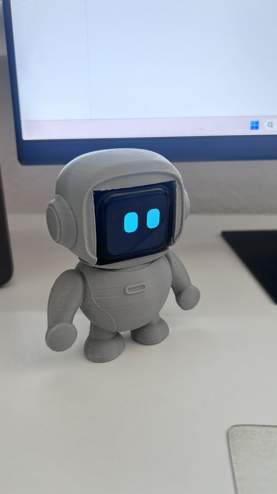
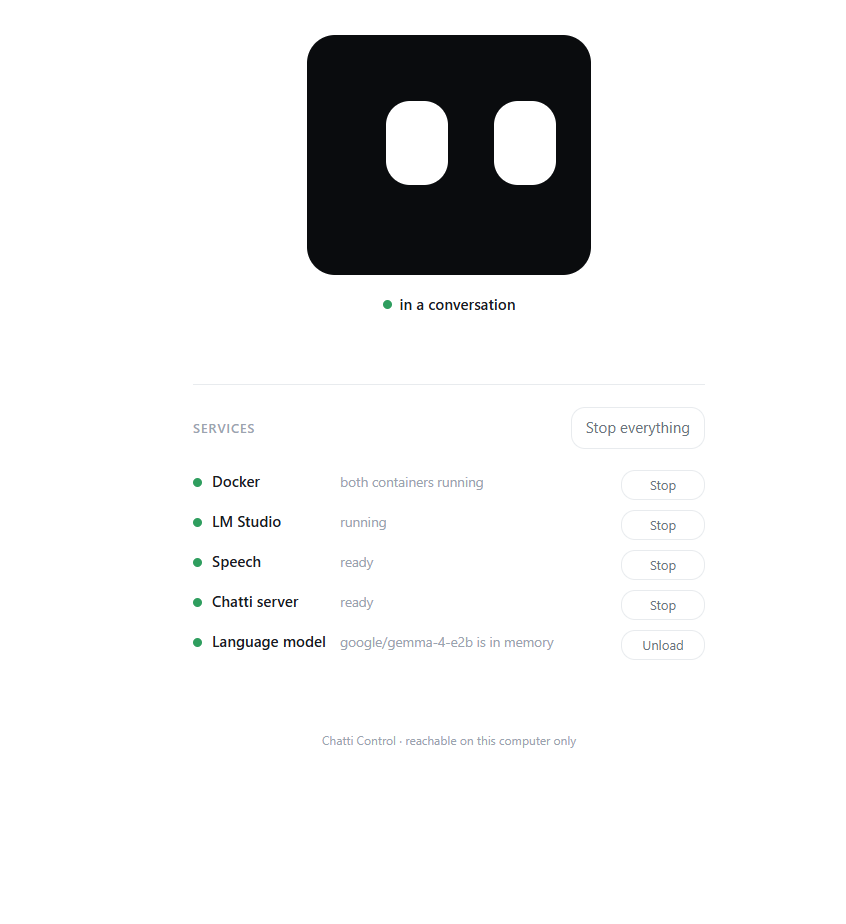
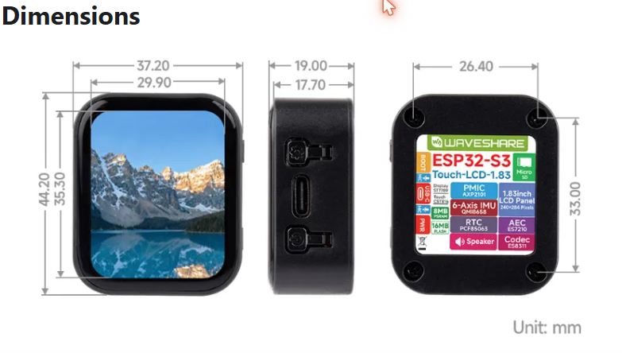

<p align="center">
  
  &nbsp;&nbsp;&nbsp;
  
</p>

# Chatti

**Talk to your own local language model. A €30 assistant on your desk, with
nothing in the cloud.**

Models that needed a data centre two years ago now fit on an ordinary gaming
GPU. What has been missing is a way to *talk* to one — without a subscription,
without an account, and without everything you say going to somebody else's
server.

Chatti is a small robot face that listens, thinks on your own PC, and answers
out loud. **Whatever model you have loaded in [LM Studio](https://lmstudio.ai/)
becomes a voice assistant** — swap the model in a dropdown and the thing on your
desk has a different mind. Speech recognition and synthesis run locally too, so
no part of a conversation leaves your network.

### What it does

- **Tap the face to talk.** Tap again when you are done. That is the whole
  interface on the device.
- **Two animated eyes** that blink and look around while idle, and step aside
  when there is something to read.
- **Subtitles paced by the voice** — each sentence scrolls over exactly its
  speaking duration, which the server measures and sends along.
- **A control panel in your browser** that starts the whole PC stack with one
  button, flashes the device over USB, and lets you pick model, voice and prompt.
- **Nothing leaves the machine.** No account, no API key, no cloud service
  anywhere in the chain.

### What it costs

| | |
|---|---|
| **Hardware** | one board, about **€30** — screen, microphone, speaker, nothing else |
| **PC** | one that stays on while you talk, running Docker Desktop and LM Studio |
| **Speed** | entirely down to your PC — **a few seconds** on hardware that fits the models comfortably, much longer on a small card |
| **Platform** | **Windows only**, for now |

**How fast it answers is not a property of Chatti.** The device encodes audio
and the network carries it; neither contributes anything measurable. All of the
waiting is the three models thinking: the LLM you loaded in LM Studio, and the
speech recognition and synthesis in Speaches. Give them a GPU that holds all
three at once and an answer comes back in a few seconds. Make them take turns on
a card too small to hold them, and the same conversation crawls — that is the
one variable that matters, and it is yours to set.

> **This is a fork of [78/xiaozhi-esp32](https://github.com/78/xiaozhi-esp32)**,
> which does the heavy lifting — the audio pipeline, the Opus codec, the board
> ports. Chatti replaces its chat UI with a face, adds voice-paced subtitles, and
> ships a control panel that runs the whole PC-side stack for you. The original
> documentation is kept under [`docs/upstream/`](docs/upstream/README.md).

This is my **first hardware project**, built to learn — and built with
[Claude Code](https://claude.com/claude-code). `CLAUDE.md` records not just what
was decided but *why*, and which of my assumptions turned out to be wrong and
what they cost. **If you are learning too, that file is probably more useful to
you than the code.**

---

<p align="center">
  
</p>

## What you need

**The board is not optional.** Chatti is written against exactly one:

> **Waveshare ESP32-S3-Touch-LCD-1.83** — the variant *without* a battery

The face, the touch controls and the audio path depend on this board's pin map,
its ES8311 codec and its CST816S touch controller. Porting to another ESP32 is
possible (xiaozhi supports dozens of boards) but it is real work.

On the PC:

| | What for | Note |
|---|---|---|
| **Docker Desktop** | the server and the speech services | two containers, one `docker-compose.yml` |
| **LM Studio** | the language model | any OpenAI-compatible model |
| **A language model** | the actual answers | `gemma-4-e2b` (≈5 GB) was used here |

Speech recognition and synthesis come from
[Speaches](https://github.com/speaches-ai/speaches), which serves both from one
container; the models download on first use. Nothing needs an account —
`api_key` values in the configuration are placeholders.

**Windows only, for now.** The control panel launches Docker Desktop and LM
Studio, and the setup scripts are `.cmd` and PowerShell. The firmware side is
plain ESP-IDF and platform-independent; the PC side is not. Ports to Linux or
macOS are welcome.

### The case — optional

The robot shape is **an idea, not a requirement**; a bare board on a desk works
just as well, which is how it was developed. Everything to print one is in
[`chatti/case/`](chatti/case/): the two halves as STL, the uncut mesh, and the
Blender source. It began as a ChatGPT drawing, became a mesh through
[Modly](https://modly3d.app/) (image-to-3D, running locally on the GPU), and was
cut into head and body in Blender around the board and its USB-C cable.

It is a **first draft** — it prints and holds the board, but the fit is rough
enough that the halves in the photo are taped together. The `.blend` is included
so that fixing it does not mean starting over. Details in
[`chatti/case/README.md`](chatti/case/README.md).

---

<p align="center">
  
</p>

## Getting started

> **Status:** this is the intended path. The one-click installer exists; a
> packaged release does not yet.

1. **Clone this repository.** Every path is derived from where the clone sits,
   so it can live anywhere — without a space in the path.
2. **Install Docker Desktop and LM Studio**, and download one language model.
3. **Start the control panel:** run `chatti\control\setup.cmd` once — it
   creates the Python environment and puts a **Chatti** shortcut on your
   desktop. That shortcut is how you start it from then on; it points at
   `chatti\control\chatti-control.cmd`, which works just as well. Either
   way the panel opens at <http://127.0.0.1:8099>. Should the shortcut
   ever go missing, `chatti\control\create-shortcut.cmd` makes it again.
4. **Work through the checklist** on the *Setup* tab. It checks Docker, the
   containers, the configuration and the firewall — and fixes what it can.
5. **Flash the device:** plug it in over USB-C, pick a firmware — **English** is
   preselected, **Deutsch** is one click away — and press the button. No ESP-IDF
   needed. If you have built neither, download `chatti-firmware.bin` from the
   [releases](../../releases) into `chatti/control/firmware/`.
6. **Tell the device your Wi-Fi — easiest with a phone.** On first start the
   device opens a hotspot of its own called **`Chatti Server-XXXX`** (the
   four characters are its own, so two devices never collide). It has no
   password. Connect your phone to it and the setup page opens by itself;
   if it does not, call up <http://192.168.4.1>. Pick your network there,
   enter its password, and the device restarts into it — the hotspot is
   gone from then on.

**Talking to it:** tap the face to start, tap again when you are done. BOOT
brings the speaker and subtitle icons back for a moment; hold it 4 seconds to
reopen Wi-Fi setup. The face on the control panel is the same one the device
draws, down to the blink timings — it is the status display, not a decoration.

---

## How it works

```
ESP32-S3 (thin client)                     PC (all the intelligence, local)
──────────────────────                     ────────────────────────────────
[microphone] → ES7210 (AEC) → ES8311 → I2S
                              ↓
                        [Opus encode, 24 kHz]
                              ↓
          ── WebSocket over WLAN ────────→  [xiaozhi-server, Docker]
                                                ↓
                                            [STT  — Speaches / faster-whisper]
                                                ↓
                                            [LLM  — LM Studio]
                                                ↓
                                            [TTS  — Speaches / Piper]
                                                ↓
                                            sentence + audio + duration
                                                ↓
          ←── audio chunk + text + timing ───
                ↓                    ↓
        [Opus decode] → I2S    [subtitle paced by the voice]
                ↓                    ↓
        speaker                [face state machine → LVGL]
```

Wi-Fi is the point: the device only needs power, so it can sit on a shelf in
another room. **A second route exists on paper** — the ESP32-S3 can present
itself to the PC as a network adapter over the USB-C cable (TinyUSB in NCM
mode), which would remove Wi-Fi setup, router trouble and firewall rules
entirely. It costs the serial console, because the chip's two USB peripherals
share the same pins. Not built — and it would change nothing about the speed,
since none of the waiting happens on the wire. The reasoning is in
`CLAUDE.md` §10.

### Two languages

The words on the device are **compiled in** — one firmware per language. Both
ship, and Chatti Control offers them next to the port:

| Firmware | On screen | Locale |
|---|---|---|
| **Chatti-ENG** *(preselected)* | `Chatti-ENG - V 1.0.1`, `Listening…` | `en-US` |
| **Chatti-DE** | `Chatti-DE - V 1.0.1`, `Hört zu…` | `de-DE` |

The PC side has its own language, set separately: `ASR.language`, the `TTS`
model/voice pair and `prompt` in `chatti/server/config.yaml`, plus
`SPEECH_LANGUAGE` in `chatti/control/app/settings.py` for the voice list.
**English is the default everywhere.**

⚠️ **Nothing checks that the two ends agree** — a German firmware on an English
server gives you German labels and English answers. Strings live in
`main/assets/locales/<locale>/language.json`; nothing in the C++ hardcodes a
language, so a third one is a translation plus a build.

---

## Building it yourself

Only needed to change the device side. Requires **ESP-IDF 6.0.2** (not 5.4.x).
First build ≈13 minutes; a language change forces a full rebuild.

```powershell
# both shipping variants into releases\, one directory each
powershell -File chatti\build-releases.ps1

# or a single build by hand
. chatti\idf-init.ps1
python chatti\build-win.py waveshare/esp32-s3-touch-lcd-1.83 --language en-US
idf.py -C . -p COM5 flash
```

### Repository layout

Everything of our own lives under `chatti/`, so it can never collide with an
upstream file when changes are merged in.

```
CLAUDE.md                decisions, measurements, pitfalls — read this first
chatti/
├── control/             the browser control panel (Python + FastAPI)
├── server/              patches for xiaozhi-esp32-server + docker-compose.yml
├── case/                printable enclosure: STLs, uncut mesh, Blender source
├── images/              the pictures in this README
├── build-win.py         build wrapper (upstream's build.py breaks on Windows)
├── build-releases.ps1   builds every shipping language into releases/
└── idf-init.ps1         sets up the ESP-IDF environment in a shell

main/chatti_discovery.*  finds the server on the network over mDNS
main/boards/waveshare/esp32-s3-touch-lcd-1.83/
├── chatti_face_display.*    the face — eyes, subtitles, controls
└── config.h                 pins, display orientation, touch

releases/                built firmwares, one directory per language, not in git
```

Everything else is xiaozhi's, and it sits at the root because **ESP-IDF puts it
there** — a project is expected to keep exactly this shape:

```
CMakeLists.txt           the project version, which is also the OTA version
main/                    firmware sources — 300 board ports, one of them ours
partitions/              flash layouts, one CSV per chip size
scripts/                 upstream tooling; build.py is the one we drive
sdkconfig.defaults       the base configuration…
sdkconfig.defaults.*     …and one file per chip family. Only `.esp32s3` is
                         ours; the rest serve boards we never build, and they
                         stay because those boards are still on offer in
                         main/Kconfig.projbuild.
docs/                    xiaozhi's documentation, the original README included
.github/                 issue templates and an inherited CI workflow
```

Worth having beside a checkout, though not in it: the
[Waveshare demos](https://github.com/waveshareteam/ESP32-S3-Touch-LCD-1.83)
(Apache-2.0, 309 MB). The schematic in them is the final word on the hardware —
it settled the most expensive mistake in this project.

### Rough edges

Working: the face, voice-paced subtitles, mute, the control panel, flashing from
the browser, mDNS discovery, and a fully local round trip. Known gaps:

- **Latency follows your hardware.** A GPU that cannot hold the LLM,
  recognition and synthesis at once makes the three take turns, and the round
  trip stretches from seconds to the better part of a minute. Nothing in Chatti
  fixes that; a bigger card does.
- **Nothing warns you** when firmware language and server language disagree.
- **Windows only** on the PC side.
- The display was turned to landscape recently and **that orientation has not
  been confirmed on hardware** by a second pair of eyes.

---

## Security: what this exposes

Chatti has **no authentication anywhere**, by design — it is a device on a desk
talking to a PC in the same flat. That is a reasonable trade at home and a bad
one elsewhere.

**Run this on a network you trust. Not on guest, office, dorm or public Wi-Fi.**

**Open to every machine on your LAN**, none of them asking who is calling:

| Port | What anyone on the LAN can do |
|---|---|
| 8000 | Open a WebSocket and hold a conversation with your language model |
| 8003 | Read the address the server hands out to devices |
| 8100 | Transcribe or synthesise anything, using your GPU |

Audio and text travel as plain `ws://`, so anyone able to capture your Wi-Fi
traffic can read what was said. TLS would mean certificates the ESP32 has to
trust — real work, not done.

**Stored unencrypted:** conversation transcripts land in
`chatti/server/data/conversations/` as plain JSON including the device's MAC.
Excluded from git, readable by anyone with access to the PC or a backup of it.
Delete the folder to be rid of them; nothing depends on it.

**The setup access point** is an *open* Wi-Fi network with no password, opened
on first start and after holding BOOT for 4 seconds. While it is open, anyone in
radio range can set which network the device joins. It closes when setup
finishes — do not leave a device sitting in setup mode.

**Chatti Control** binds to `127.0.0.1` only and checks the `Host` and `Origin`
of every request. That matters more than it sounds: without those checks any web
page you visited could start your stack, and a rebound DNS name could have read
the transcripts back out. Both are refused now. The panel does start programs,
rewrite configuration and flash firmware, so treat local access to your PC as
access to all of it.

**Genuinely not exposed:** no account, no API key, no cloud service. The
firmware holds no credentials — Wi-Fi password and server address live in the
device's NVS storage, not in the source or the binary.

---

## Licence and credits

Chatti is **MIT licensed**, and so is everything it is built from.

| Shipped here | |
|---|---|
| [78/xiaozhi-esp32](https://github.com/78/xiaozhi-esp32) | MIT — the firmware this is forked from (Shenzhen Xinzhi Future Technology). Most of `main/` is theirs. |
| [xinnan-tech/xiaozhi-esp32-server](https://github.com/xinnan-tech/xiaozhi-esp32-server) | MIT — eight files under `chatti/server/` are modified copies, each carrying a header saying so. |

`LICENSE` carries all copyright lines, including the upstream ones. Keeping it
is the single condition the MIT licence attaches to using, changing and
redistributing this code.

**Downloaded on your machine, not distributed here** — those terms are between
you and them:

- [Speaches](https://github.com/speaches-ai/speaches) (MIT), pulled as a Docker
  image.
- [Piper](https://github.com/OHF-Voice/piper1-gpl) voices — Piper's current home
  is GPL-3.0, the older `rhasspy/piper` was MIT. Individual voices carry their
  own licences: the German ones build on Thorsten Müller's public-domain
  dataset, the English ones come from several community sets. Check before
  redistributing any of them.
- **The language model is not included.** Gemma and others come with their own
  usage terms.
