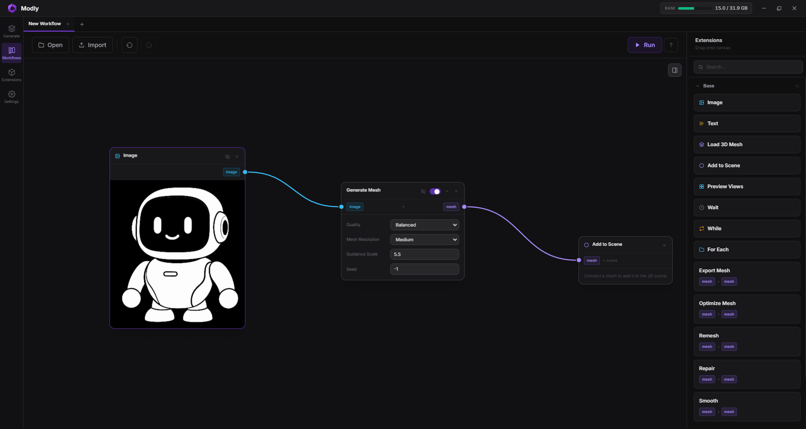
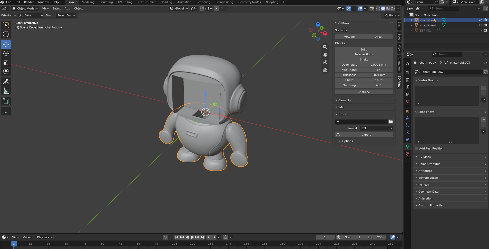

# Case

The robot design is **an inspiration, not a specification**. Print it as it is,
modify it, or skip it entirely — Chatti works just as well as a bare board on a
desk, which is how it was developed.

⚠️ **This is a first draft.** It prints, it holds the board, and it looks like
the robot in the README — but the model is imprecise. The two halves do not
click together: the print in the photos is held with tape around the seam.
Treat the files as a starting point to fix, not as a finished enclosure.

| File | What it is |
|---|---|
| `chatti-obj-chatti-head.stl` | the head — the display faces forward through it |
| `chatti-obj-chatti-body.stl` | the body it stands on |
| `chatti-obj-raw-model.stl` | the undivided model, before it was cut in two |
| `chatti-obj.blend` | the Blender source everything above was exported from |

## Where the shape came from

Nothing here was modelled by hand from scratch:

1. **A picture.** The robot began as an image generated with ChatGPT — the one
   at the top of the main README.
2. **Image to mesh.** That single picture was turned into a 3D mesh with
   [Modly](https://modly3d.app/), an open-source image-to-3D tool that runs the
   reconstruction model locally on your own GPU. Three nodes — image in,
   generate, done. `chatti-obj-raw-model.stl` is what came out of it, untouched.

   

3. **Blender.** The raw mesh was cut into head and body, hollowed for the ESP32
   board, and opened at the underside for the USB-C cable. The board sits in the
   scene as its own object, so the cavity is cut against the real thing.
   `chatti-obj.blend` is that file; the two part STLs are exported from it.

   

The imprecision noted above comes from step 2: a mesh reconstructed from one
image is a likeness, not a dimensioned part. Step 3 is where anyone improving
this should start — hence the `.blend` in this folder.

## Head and body are printed separately

They are two prints, not one. Printing the head on its own is what makes the
shell buildable at all — and it is also what leaves the board's connectors
reachable.

**Everything you plug in is on the underside of the board:** the USB-C port and
the BOOT and power buttons all sit below the ESP32. USB-C is the only cable and
it is permanent — Chatti has no battery and draws power over USB the whole time
it runs. The body therefore has a **hole in its underside**, so the cable can be
routed out at the bottom and secured there instead of pushing the case around.

Anyone redesigning the shape should keep that opening; everything else is free.

## Printing

Binary STL, so any slicer will take them. No settings are prescribed here —
layer height, infill and supports depend on your printer and filament far more
than on the model.
